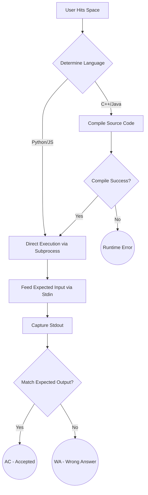

<div align="center">


*A blazing fast, One Dark-themed local test case runner for developers.*

[](https://pypi.org/project/casecraft/)
[](https://www.python.org/downloads/)
[](https://opensource.org/licenses/MIT)
[](https://github.com/psf/black)
[](https://github.com/Textualize/textual)

<br/>

<!-- Showcase GIF -->


</div>

---

## ❓ Why CaseCraft?

> [!NOTE]
> Are you tired of writing temporary `print()` statements? Sick of manually typing inputs or piping `.txt` files into your scripts just to check if your edge cases work?
>
> **CaseCraft** eliminates the hassle by bringing a dedicated test environment directly into your terminal. Designed with a lazygit-style, keyboard-driven UI, CaseCraft allows you to quickly write, organize, and execute tests without ever touching your mouse.

---

## ✨ Features

- **Dynamic Boot Sequence**: Hacker-style splash screen that automatically checks PyPI for version updates in the background.
- **Native Transparency**: Automatically inherits your terminal's background color and opacity for a stunning glass-like aesthetic.
- **Lazygit-Style Interface**: Fully keyboard-driven UI designed for maximum developer speed.
- **Cross-Platform Execution**: Safely evaluates the correct executable environments (e.g. `python3` vs `python`) across macOS, Linux, and Windows.
- **Local Persistence**: Test cases are safely persisted per-file inside a hidden `.casecraft/` folder in your project workspace.

---

## 🚀 Quick Start

### Installation

CaseCraft is available via pip. It requires **Python 3.11+**.

```bash
pip install casecraft
```

### Initialization

To start using CaseCraft in a new project, run the initialization command in your project's root directory:

```bash
casecraft init
```

> [!TIP]
> This generates a `.casecraft/` workspace folder where all your test cases will be securely saved per file. You can safely add `.casecraft/` to your `.gitignore`.

### Launch the Dashboard

```bash
casecraft
```

### Headless Execution Mode

Want to skip the UI entirely? If you've already added test cases for a file, you can pass the file path as an argument to run all tests headlessly directly in the console:

```bash
casecraft main.cpp
```

CaseCraft will intelligently compile your code (if needed), execute the tests asynchronously, and render a beautiful, color-coded execution summary table straight to stdout!

---

## ⚙️ How It Works Under the Hood

<details>
<summary><b>Click to reveal the architectural flowchart</b></summary>
<br/>

CaseCraft handles all the heavy lifting of compilation, execution, and process management behind the scenes:


</details>

---

## ⌨️ Keyboard Shortcuts

CaseCraft is built for speed. Once the dashboard is open, use these keybindings to navigate seamlessly:

| Action | Key | Context |
|---|:---:|---|
| **Load Source File** | <kbd>p</kbd> | Opens a visual directory tree to select a file |
| **Switch Focus** | <kbd>Tab</kbd> | Toggles focus between the Problems table and Test Case table |
| **Add Test Case** | <kbd>a</kbd> | Opens the Add Test Case modal |
| **Edit Test Case** | <kbd>e</kbd> | Edits the currently highlighted test case |
| **Delete Test Case** | <kbd>d</kbd> | Deletes the currently highlighted test case |
| **Search / Filter** | <kbd>/</kbd> | Opens the search bar (Press <kbd>Esc</kbd> to clear) |
| **Run All Tests** | <kbd>Space</kbd> | Executes all test cases for the active file |
| **Quit** | <kbd>q</kbd> | Exits CaseCraft |

---

## 🛠️ Supported Languages

CaseCraft natively supports running files from multiple programming languages out of the box:

- **Python** (`.py`)
- **JavaScript** (`.js`)
- **C++** (`.cpp`, `.cc`) — *Automatically compiles using `g++` to a temporary directory.*
- **Java** (`.java`) — *Automatically compiles using `javac`.*

---

## 🚦 Verdicts

After pressing <kbd>Space</kbd> to run your tests, CaseCraft will display clear, color-coded verdicts:

- 🟢 **`AC` (Accepted)** — Actual output exactly matches the expected output. *(Note: Trailing whitespaces and blank lines are ignored).*
- 🔴 **`WA` (Wrong Answer)** — Actual output differs from expected.
- 🟡 **`TLE` (Time Limit Exceeded)** — Execution took longer than the standard 2.0-second timeout limit.
- 🟣 **`RE` (Runtime Error)** — The script exited with a non-zero exit code or threw an exception.

---

## 🗺️ Roadmap & Future Goals

> [!IMPORTANT]
> The project is under active development. Here are the upcoming features on our radar:

- [x] Initial PyPI Release
- [x] LazyGit-Style Navigation
- [x] Python, C++, JS, and Java Support
- [ ] **Custom Execution Arguments:** Pass custom flags to compilers.
- [ ] **Memory Tracking:** Display exact memory footprint during execution.
- [ ] **Detailed Diff View:** Expand a test case to see a precise `git diff` style output highlighting where the Expected and Actual outputs differ.

---

## 🤝 About & Support

**CaseCraft** is passionately built and maintained by **Saksham Tale**.

If you encounter any bugs, have a cool feature request, or want to contribute, please visit the official [Issue Tracker](https://github.com/Saksham-cmd-tech/caseRunner/issues).
